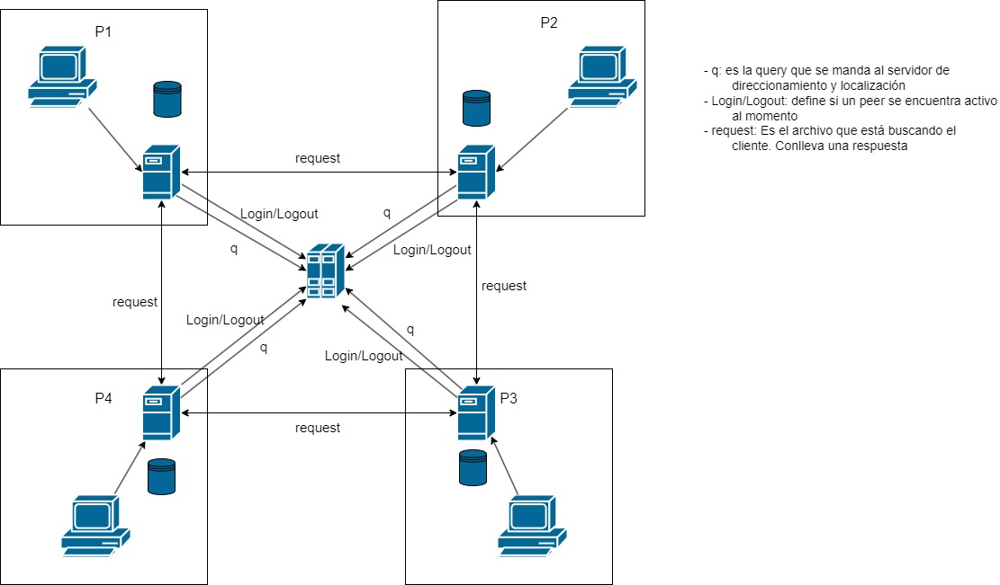
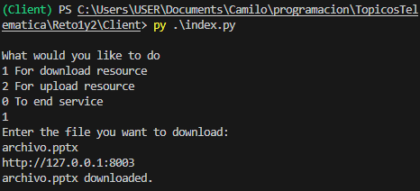
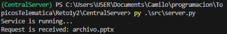
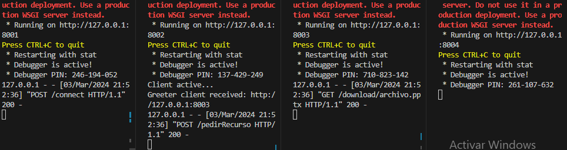

# info de la materia: ST0263 Tópicos Especiales en Telemática
#
# Estudiante(s): Camilo Palacio Restrepo, cpalacior@eafit.edu.co
#
# Profesor: Edwin Montoya Munera, emontoya@eafit.edu.co
#

# Reto No 1 y 2
#
# 1. breve descripción de la actividad
#
Esta actividad pretende la creación de una arquitectura de tipo P2P. Se basa en una arquitectura no estructurada con servidor central que cumple la función de direccionamiento y localizador. Se busca la transparencia para que los clientes no conozcan que existe este servidor central y se logra implementando el uso de un peer vecino. El cliente llamará a su peer y este llamará al peer vecino, que luego llamará al servidor central para poder conseguir la url del recurso y poder llamar directamente al peer que lo contenga.

## 1.1. Que aspectos cumplió o desarrolló de la actividad propuesta por el profesor (requerimientos funcionales y no funcionales)
#
Se logró el diseño de la arquitectura que cumpla con los requisitos dentro del enunciado. De igual forma se logró que cada peer tuviera su peer vecino para que se cumpla con la transparencia. Se logró que hubiera una concurrencia en los PServidores. El microservicio de Download fue el único que se logró implementar 

## 1.2. Que aspectos NO cumplió o desarrolló de la actividad propuesta por el profesor (requerimientos funcionales y no funcionales)
#
Con respecto a lo que no se pudo lograr, no se logró la implementación de el microservicio de update. y de igual forma no se pudo realizar el ping al servidor central por parte de los peers para mostrar que están activos.
No se pudo completar la parte del despliegue.

# 2. información general de diseño de alto nivel, arquitectura, patrones, mejores prácticas utilizadas.

El sistema está compuesto de 3 componentes principales y 2 tipos de comunicación. Dentro de los componentes está el cliente, que se comunica por API Rest al PServer correspondiente, este se comunica por API Rest al PServer vecino, este se comunica con el servidor central haciendo uso de RPC con grpc, usando el protocol buffer proto3.

# 3. Descripción del ambiente de desarrollo y técnico: lenguaje de programación, librerias, paquetes, etc, con sus numeros de versiones.
Dentro de cada una de las carpetas se creó un archivo para descargar las librerías necesarias con sus numeros de versiones, ese archivo se llama requirements.txt. Todo el sistema está programado en python en un ambiente virtual.
## como se compila y ejecuta.
Para ejecutar al cliente lo único que se necesita es estar en la carpeta raiz de la terminal y poner este comando:
> py index.py

Para ejecutar al cada PServer, debes estar en la carpeta src en la terminal y poner este comando:
> py index.py

Para ejecutar al Servidor Central debes estar en la carpeta src en la terminal y poner este comando:
> py server.py
## detalles del desarrollo y técnicos.

Los servidores de los Pserver los hice con el microframework Flask, que se encargaba de al concurrencia y del la creación de rutas para el envío de información por API Rest, de igual forma, cada PServer cuenta con un archivo que permite la conexión por grpc al servidor central. Este último está hecho en python y únicamente cuenta con la conexión rpc. El cliente es un archivo python que se ejecuta infinitamente hasta que se accione la terminación del proceso y se conecta por http al servidor de flask de su respectivo PServer.

## descripción y como se configura los parámetros del proyecto (ej: ip, puertos, conexión a bases de datos, variables de ambiente, parámetros, etc)
En el la raiz de la carpeta del Cliente está un archivo de creacion de variables de entorno ".env". En este archivo se escribe unicamente URL_PEERAS = "url del PServer" donde se encuentra la url del PServer asociado.
En la raiz de la carpeta de cada uno de los PServer se encuentra el ".env". En este caso se pondrá 
> URL_Request = "ip:51015"  --> donde la ip es es la ip de despliegue
> PORT = "80"
> URL_PEERSU = "ip:80" --> donde la ip es la ip de despliegue
En la raiz de la carpeta de CentralServer se encuentra el ".env". donde se escribe unicamente el host de la conexión del rpc 
> HOST = '[::]:51015'
## 
## opcionalmente - si quiere mostrar resultados o pantallazos 

# 4. Descripción del ambiente de EJECUCIÓN (en producción) lenguaje de programación, librerias, paquetes, etc, con sus numeros de versiones.

# IP o nombres de dominio en nube o en la máquina servidor.
Del servidor central ip: 3.85.104.123
Del Peer 1: 54.221.76.141
Del peer 2: 54.242.130.2
Del peer 3: 54.91.7.191
Del peer 4: 34.202.236.53
## descripción y como se configura los parámetros del proyecto (ej: ip, puertos, conexión a bases de datos, variables de ambiente, parámetros, etc)

## como se lanza el servidor.

## una mini guia de como un usuario utilizaría el software o la aplicación

## opcionalmente - si quiere mostrar resultados o pantallazos 

# 5. otra información que considere relevante para esta actividad.
github al servidor central 
> https://github.com/cpalacior/CentralServer.git

github al peer
> https://github.com/cpalacior/PServer.git

github al Cliente
> https://github.com/cpalacior/Client.git
# referencias:
## [Referenicia RPC](https://grpc.io/)
## [Referencia Protobuf](https://protobuf.dev/)
## [url de donde tomo info para desarrollar este proyecto](https://medium.com/@prateekbansalind/python-programs-4-dockerizing-your-flask-api-for-seamless-deployments-28c1842a92cb)
## [ejemplos de rpc](https://github.com/grpc/grpc/tree/master/examples/python/helloworld)
